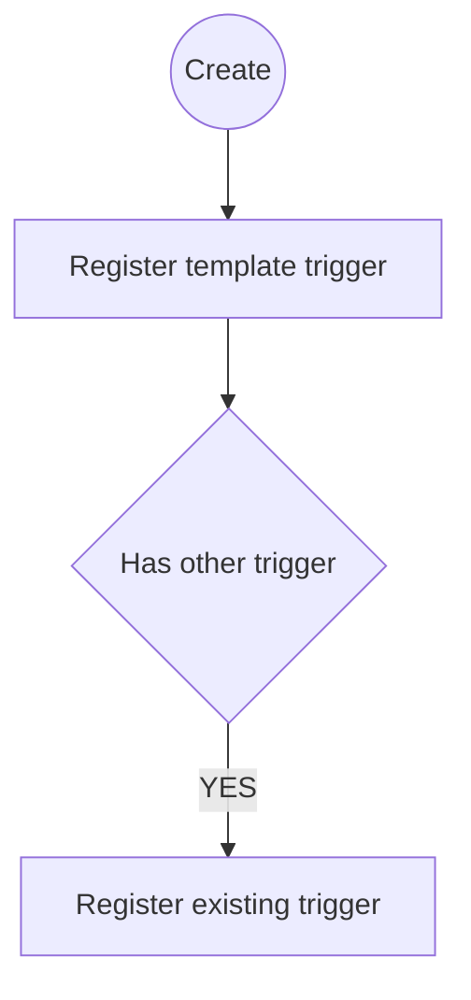
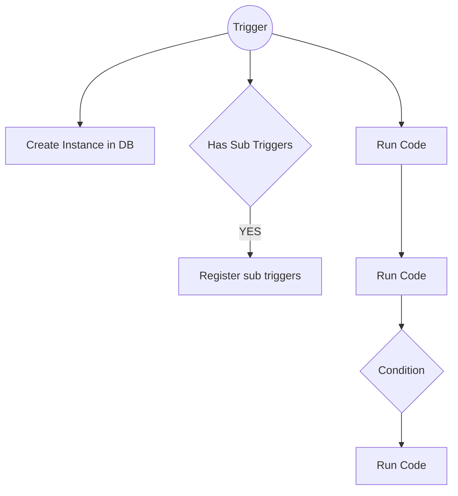

Every workflow can have up to 2 triggers (one existing trigger and one workflow specific trigger (trigger id))

Creating:

Running:

How do workflow elements transfer data from one action to the next?
1. Through request/response objects?
   1. Action 1 creates response
   2. Workflow takes result and forms new request (expands original request)
   3. Action 2 takes request and performs action

This means that after every action a general workflow function has to take over and generate the next request. However this is to be expected anyways?

// Sample Workflows

Billing:

1. Get active subscriptions for the day
   1. option1: date (default = now)
   2. option2: client (default = wildcard for all)
   3. option3: payment type (default = cc, future = multiselect)
2. Create new invoice based on subscription
3. Is successful
   1. yes: send email
   2. no: inform sales person + deactivate benefits

